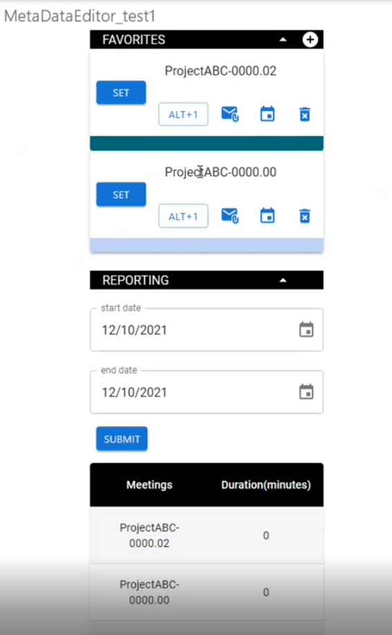

# email-property-manager

# Install

launch outlook -> click file button at top bar -> click Manage-Add-ins button -> click "My add-ins"  
under "Custom add-ins click "Add a custom add-in" -> attach manifest.xml file from the package  

# Usage
run "npm install" to Install required node modules  
In the project directory, run "npm start" to start dev serve on port 3000  
Once it's launched, an add-in button will appear on top bar.

# Main Functionality
- Add/Delete new Project to ProjectList
(The projectList information was stored as MultiValueExtendedProperty under property name "myTest" of drafts mail folder).
- Initiate a new Email with SingleValueExtendedProperty under property name "myTest" associated with new mail item.
- Initiate a new Event Appointment with ProjectName & ProjectNumber as part of Event subject.
- Report Time duration of each listed project for selected time span.

# To Do List
- Code Style
  1. suggest put feature relavent function into a Util file and imported back into the file App.js
  2. suggest create a individual file to store all constants, including rest url, unchanged property variable name, etcs.
  3. Some codes were already crossed out is to be deleted yet.
- Component UI
  1. Some UI to be refined. (space between projectList card, reordering function)
- Functionality & Performance
  1. authToken is being fetch every time before function call. Suggest store it as app state and refresh it only when token expires.
  2. Reporting function is based on parsing of event subject using regex. But Miscrosfot Rest API only returns 10 items every call by default. Suggest solving the pagnation issue when dealing with longer time span with more events as return. 
